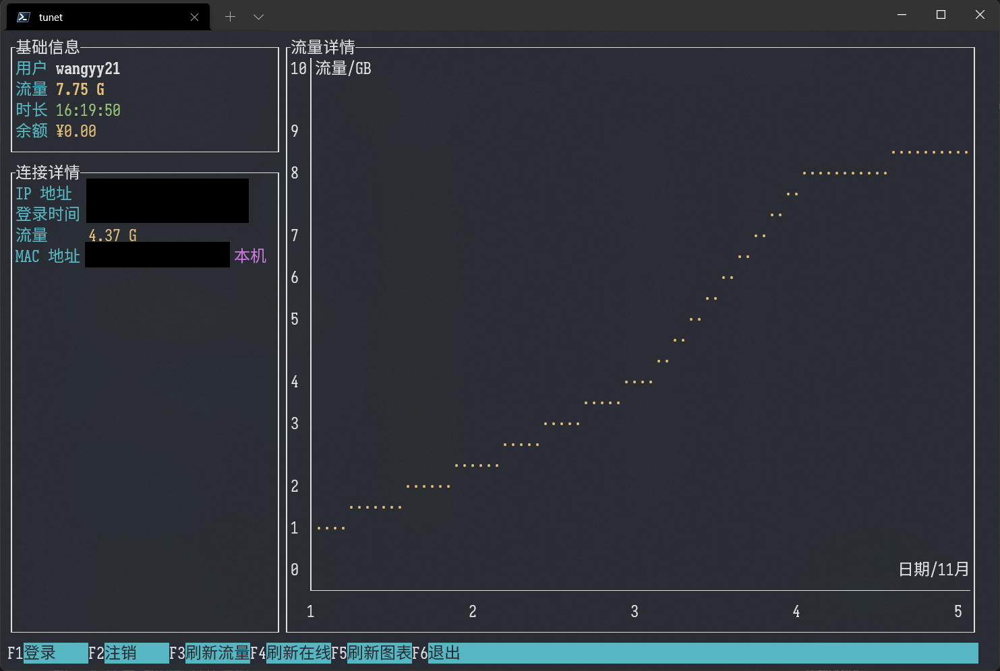

# tunet-rust
清华大学校园网 Rust 库与客户端。

[](https://strawberry-vs.visualstudio.com/tunet-rust/_build)

## GUI
基于 [Slint](https://slint-ui.com/) 开发。

| 平台    | 亮                                   | 暗                                  |
| ------- | ------------------------------------ | ----------------------------------- |
| Windows |  |  |
| Linux   |      | （暂无图片）                        |
| macOS   |        |        |

## CUI（命令行图形界面）
使用如下命令启动：

``` bash
# 使用默认（自动判断）方式登录/注销
$ ./tunet-cui
# 使用 auth4 方式登录/注销
$ ./tunet-cui -s auth4
```



## 命令行
### 登录/注销
``` bash
# 使用默认（自动判断）方式登录
$ ./tunet login
# 使用默认（自动判断）方式注销
$ ./tunet logout
# 使用 auth4 方式登录
$ ./tunet login -s auth4
# 使用 auth4 方式注销
$ ./tunet logout -s auth4
```
### 在线状态
``` bash
# 使用默认（自动判断）方式
$ ./tunet status
# 使用 auth4 方式
$ ./tunet status -s auth4
```
### 查询/强制下线在线 IP
``` bash
# 查询
$ ./tunet online
# IP 上线
$ ./tunet connect -a IP地址
# IP 下线
$ ./tunet drop -a IP地址
```
### 流量明细
``` bash
# 使用默认排序（注销时间，升序）查询明细
$ ./tunet detail
# 使用登录时间（升序）查询明细
$ ./tunet detail -o login
# 使用流量降序查询明细
$ ./tunet detail -o flux -d
# 使用流量降序查询明细，并按注销日期组合
$ ./tunet detail -o flux -dg
```
### Nushell 集成
`status`、`online`、`detail` 子命令支持 `--nuon` 参数，可以配合 Nushell 得到结构化的数据：
``` bash
# 在线状态表格
> ./tunet status --nuon | from nuon
# 查询在线 IP 表格
> ./tunet online --nuon | from nuon
# 明细表格
> ./tunet detail --nuon | from nuon
# 使用流量降序查询明细，并按注销日期组合
> ./tunet detail -g --nuon | from nuon | sort-by flux -r
```

### Windows 服务/macOS launchd
``` bash
# 注册服务
$ ./tunet-service register
# 注册服务，并定时5分钟连接一次
$ ./tunet-service register -i "5min"
# 注销服务
$ ./tunet-service unregister
```
注意 `tunet-service.exe` 自身是服务程序，如需删除应先注销服务。

## keyring
用户名和密码在第一次登录时根据提示输入，不同平台管理密码方法如下：

| 平台    | 方法                                                                                      |
| ------- | ----------------------------------------------------------------------------------------- |
| Windows | [Windows Credential Manager](https://docs.microsoft.com/en-us/windows/win32/api/wincred/) |
| Linux   | [Keyrings](https://man7.org/linux/man-pages/man7/keyrings.7.html)                         |
| macOS   | [Keychain](https://developer.apple.com/documentation/security/keychain_services)          |

对于不支持密码管理的 Linux 发行版，会回退到**明文**密码。

在 WSL 上保存的密码会在 WSL 重启后消失。

请不要在不信任的电脑上保存密码。可以在图形界面点击“删除并退出”，或在命令行使用如下命令删除：
``` bash
$ ./tunet deletecred
```

## netstatus
针对 Windows, Linux, macOS 使用了平台特定的方式尝试获得当前的网络连接方式，如果是无线网连接还会获取 SSID。
如果无法获取，则尝试连接特定的网址来判断。

| 平台    | 方法                                                                         |
| ------- | ---------------------------------------------------------------------------- |
| Windows | `Windows::Networking::Connectivity`                                          |
| Linux   | [Netlink](https://wiki.linuxfoundation.org/networking/generic_netlink_howto) |
| macOS   | System Configuration 与 Core WLAN                                            |

## 编译说明
使用 `cargo` 直接编译：
``` bash
$ cargo build --release
```
即可在 `target/release` 下找到编译好的程序。
