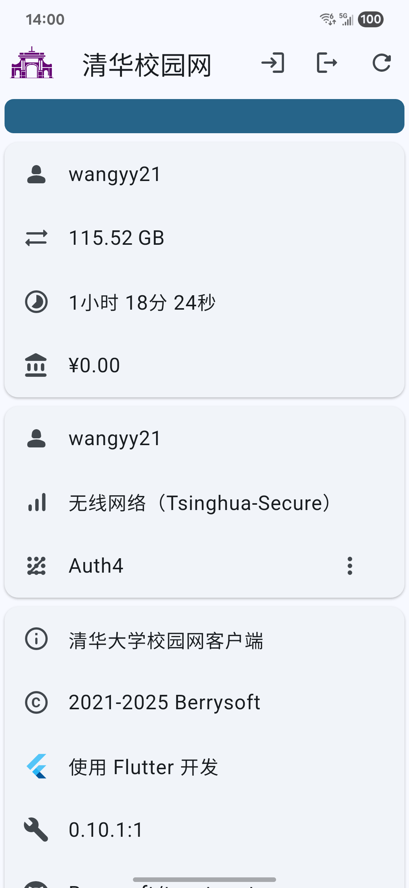

# tunet-rust
清华大学校园网 Rust 库与客户端。

[](https://strawberry-vs.visualstudio.com/tunet-rust/_build)

## GUI（桌面端）
基于 [Slint](https://slint-ui.com/) 开发。使用如下命令启动：

``` bash
$ tunet-gui
```

| 平台    | 亮                                   | 暗                                  |
| ------- | ------------------------------------ | ----------------------------------- |
| Windows |  |  |
| Linux   |      | （暂无图片）                        |
| macOS   |        |        |

## GUI（移动端）
基于 [Flutter](https://flutter.dev/) 开发。会尽量保证 iOS 版本能用，但是没钱发布。

| 平台    | 亮                                   | 暗                                  |
| ------- | ------------------------------------ | ----------------------------------- |
| Android |  |  |

## 命令行
### 登录/注销
``` bash
# 使用默认（自动判断）方式登录
$ tunet login
# 使用默认（自动判断）方式注销
$ tunet logout
# 使用 auth4 方式登录
$ tunet login -s auth4
# 使用 auth4 方式注销
$ tunet logout -s auth4
```
### 在线状态
``` bash
# 使用默认（自动判断）方式
$ tunet status
# 使用 auth4 方式
$ tunet status -s auth4
```
### 查询/强制下线在线 IP
``` bash
# 查询
$ tunet online
# IP 上线
$ tunet connect -a IP地址
# IP 下线
$ tunet drop -a IP地址
```
### 流量明细
``` bash
# 使用默认排序（注销时间，升序）查询明细
$ tunet detail
# 使用登录时间（升序）查询明细
$ tunet detail -o login
# 使用流量降序查询明细
$ tunet detail -o flux -d
# 使用流量降序查询明细，并按注销日期组合
$ tunet detail -o flux -dg
```
### Nushell 集成
`status`、`online`、`detail` 子命令支持 `--nuon` 参数，可以配合 Nushell 得到结构化的数据：
``` bash
# 在线状态表格
> tunet status --nuon | from nuon
# 查询在线 IP 表格
> tunet online --nuon | from nuon
# 明细表格
> tunet detail --nuon | from nuon
# 使用流量降序查询明细，并按注销日期组合
> tunet detail -g --nuon | from nuon | sort-by flux -r
```

### Windows 服务/macOS launchd
``` bash
# 注册服务
$ tunet-service register
# 注册服务，并定时5分钟连接一次
$ tunet-service register -i "5min"
# 注销服务
$ tunet-service unregister
```
注意 `tunet-service.exe` 自身是服务程序，如需删除应先注销服务。

### Systemd
由于不同 Linux 发行版的服务机制不同，没有提供 `register` 和 `unregister` 命令。
Debian 打包提供了 `tunet@.service` 文件。对于用户 `foo`，可以运行
``` bash
# 启用服务
$ sudo systemctl enable tunet@foo
# 启动服务
$ sudo systemctl start tunet@foo
```
可以通过编辑该文件来调整重复登录的间隔。

## 密码
用户名和密码在第一次登录时根据提示输入。请不要在不信任的电脑上保存密码。可以在桌面端图形界面点击“删除并退出”，或在命令行使用如下命令删除：
``` bash
$ tunet deletecred
```
注意：由于 Linux 的限制，目前没有找到合适的持续化密码保存方法，因此会直接明文存储。

## 网络状态
针对不同平台使用平台特定的方式尝试获得当前的网络连接方式，如果是无线网连接还会获取 SSID。
如果无法获取，则尝试连接特定的网址来判断。

<table>
  <thead>
    <tr>
      <th>平台</th>
      <th>网络状态</th>
      <th>WIFI SSID</th>
      <th>MAC 地址</th>
    </tr>
  </thead>
  <tbody>
    <tr>
      <td>Windows</td>
      <td colspan="2">Windows::Networking::Connectivity</td>
      <td>GetAdaptersAddresses</td>
    </tr>
    <tr>
      <td>Linux</td>
      <td>（无）</td>
      <td>Netlink</td>
      <td rowspan="4">getifaddrs</td>
    </tr>
    <tr>
      <td>Android</td>
      <td>ConnectivityManager</td>
      <td>WifiManager</td>
    </tr>
    <tr>
      <td>macOS X</td>
      <td rowspan="2">System Configuration</td>
      <td>Core WLAN</td>
    </tr>
    <tr>
      <td>iOS</td>
      <td>NEHotspotNetwork</td>
    </tr>
  </tbody>
</table>

## 编译说明
使用 `cargo` 直接编译：
``` bash
$ cargo build --release --workspace --exclude native
```
即可在 `target/release` 下找到编译好的程序。

若要为 Android 编译 APK：
``` bash
$ cd tunet-flutter
$ make apk
```
即可在 `tunet-flutter/build/app/outputs/flutter-apk/app-<架构>-release.apk` 找到打包。

## 安装说明
从 Releases 即可找到最新版分发。

### Arch Linux
有第三方打包的 AUR 和 [archlinuxcn](https://www.archlinuxcn.org/) 源可以安装。
